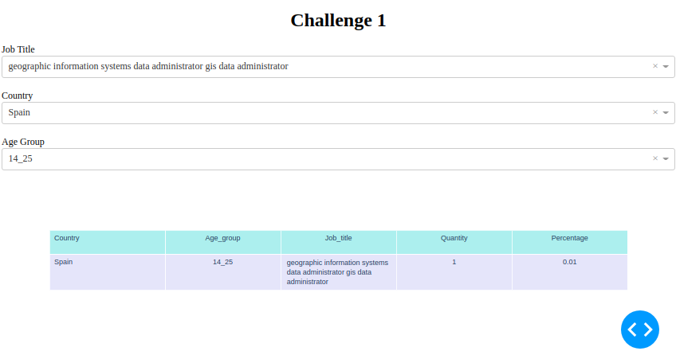

# Data Project README file

The README file describes the essence of the project playing the most important role. Most visitors will simply scroll down about twice on the README and leave if they are not interested. So, the README file should provide the reason **why** to checkout your project!!!). 
Bearing that in mind, your job is to: 
- Tell them what it is (with context).
- Show them what it looks like in action.
- Show them how they use it.
- Tell them any other relevant details

---

### :raising_hand: **Name** 
Self-explanatory names are best. If the name sounds too vague or unrelated, it may be a signal to move on. It also must be catchy. Images, Logo, Gif or some color is strongly recommended.

### :baby: **Status**
Alpha, Beta, 1.1, Ironhack Data Analytics Final Project, etc... It's OK to write a sentence, too. The goal is to let interested people know where this project is at.

### :running: **One-liner**
Having a one-liner that describes the pipeline/api/app is useful for getting an idea of what your code does in slightly greater detail. 

### :computer: **Technology stack**
Python, Pandas, Scipy, Scikit-learn, etc. Indicate the technological nature of the software, including primary programming language(s), main libraries and whether the software is intended as standalone or as a module in a framework or other ecosystem.

### :wrench: **Configuration**
Requeriments, prerequisites, dependencies, installation instructions.

### :see_no_evil: **Usage**
Parameters, return values, known issues, thrown errors.

### :shit: **ToDo**
Next steps, features planned, known bugs (shortlist).

### :love_letter: **Contact info**
davidblancoferrandez@gmail.com
